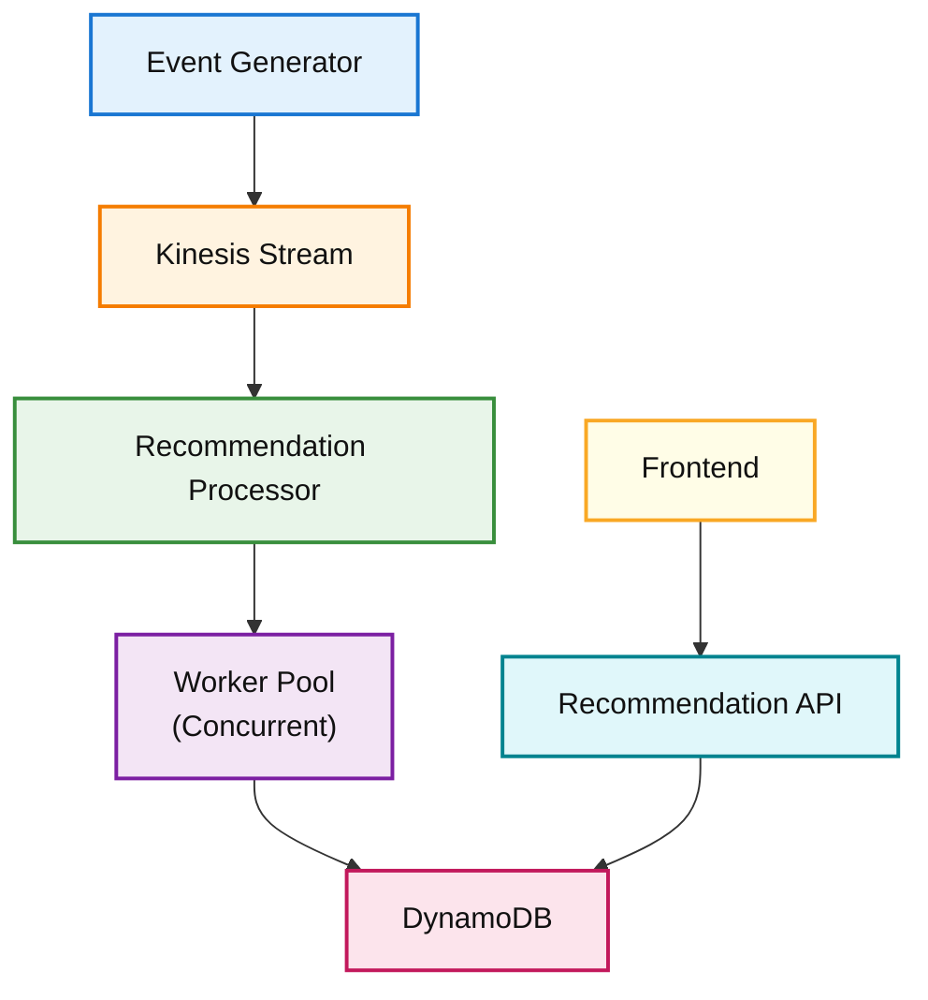

# Architecture Decision Records (ADR)

## ADR-001 — Database
**Decision:** Use DynamoDB.

**Reason:** Queries are performed by key (userId) and require low latency. DynamoDB provides a key-value model that is well suited to this access pattern and scales horizontally.

## ADR-002 — Asynchronous Communication
**Decision:** Use Kinesis.

**Reason:** It decouples event generation from processing, allows the system to absorb traffic spikes, and makes it possible to scale consumers independently.

## ADR-003 — Go
**Decision:** Implement the service in Go.

**Reason:** Excellent performance, straightforward concurrency using goroutines and channels, lightweight binaries, and startup times suitable for Lambda.

## Diagram

