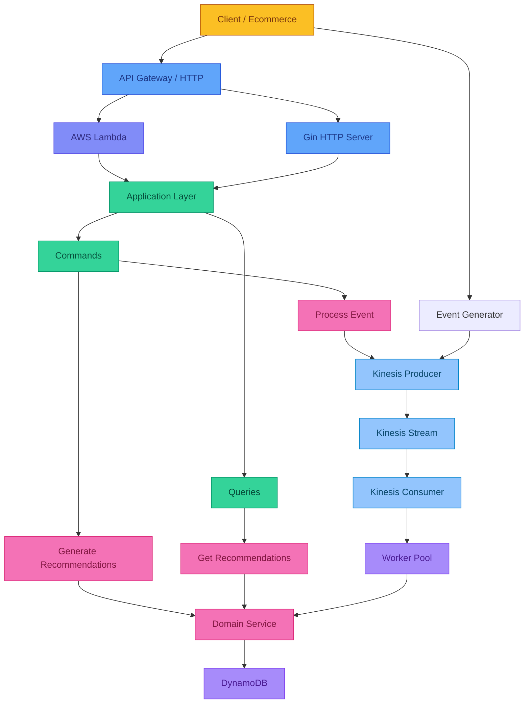

## Application Flow Overview

### 1. User Gets Recommendations (Read Path)
```
Client → API Gateway → Lambda/Gin → GetRecommendations Query → Domain Service → DynamoDB → Recommendations
```

### 2. User Interaction Event (Write Path)
```
Ecommerce → Event Generator → Kinesis Producer → Kinesis Stream → Kinesis Consumer → Worker Pool → Process Event Command → Domain Service → DynamoDB
```

### 3. Offline Recommendation Generation
```
Batch Events → Generate Recommendations Command → Domain Service → Recommendations (in-memory)
```

## Component Responsibilities

### HTTP Layer
- **Gin HTTP Server**: REST API endpoints for local development
- **AWS Lambda**: Serverless function for production deployment
- **API Gateway**: AWS API Gateway for Lambda integration

### Application Layer
- **Commands**: Write operations (Process Event, Generate Recommendations)
- **Queries**: Read operations (Get Recommendations)
- **DTOs**: Data transfer objects for layer boundaries

### Domain Layer
- **Recommendation Service**: Core business logic
- **Event Processing**: Scoring, interest calculation, ranking
- **Repository Interface**: Abstraction for data persistence

### Infrastructure Layer
- **Kinesis Producer**: Publishes events to stream
- **Kinesis Consumer**: Reads events from stream
- **Worker Pool**: Concurrent event processing
- **DynamoDB Repository**: Data persistence
- **Memory Repository**: In-memory persistence for testing

### External Services
- **DynamoDB**: NoSQL database for recommendations
- **Kinesis**: Event streaming platform
- **LocalStack**: Local AWS simulation for development
