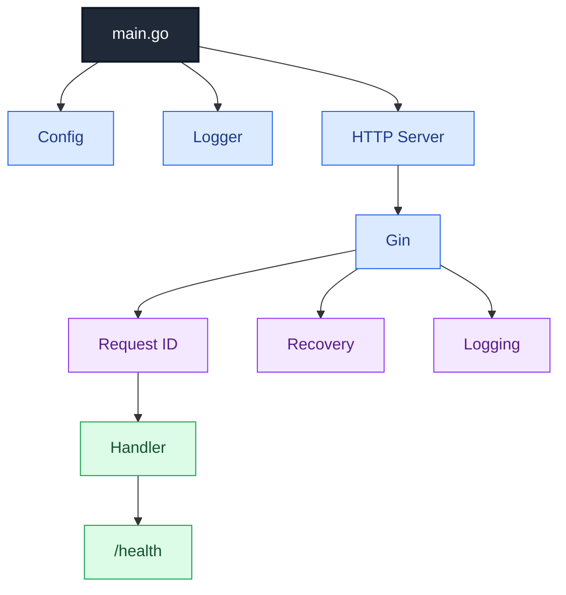

```mermaid
flowchart TD
    MAIN["main.go"]

    MAIN --> CONFIG["Config"]
    MAIN --> LOGGER["Logger"]
    MAIN --> HTTP_SERVER["HTTP Server"]

    HTTP_SERVER --> GIN["Gin"]

    GIN --> REQUEST_ID["Request ID"]
    GIN --> RECOVERY["Recovery"]
    GIN --> LOGGING["Logging"]

    REQUEST_ID --> HANDLER["Handler"]
    HANDLER --> HEALTH["/health"]

    classDef main fill:#1f2937,stroke:#111827,color:#fff,stroke-width:2px
    classDef infrastructure fill:#dbeafe,stroke:#2563eb,color:#1e3a8a
    classDef middleware fill:#f3e8ff,stroke:#9333ea,color:#581c87
    classDef endpoint fill:#dcfce7,stroke:#16a34a,color:#14532d

    class MAIN main
    class CONFIG,LOGGER,HTTP_SERVER,GIN infrastructure
    class REQUEST_ID,RECOVERY,LOGGING middleware
    class HANDLER,HEALTH endpoint
```