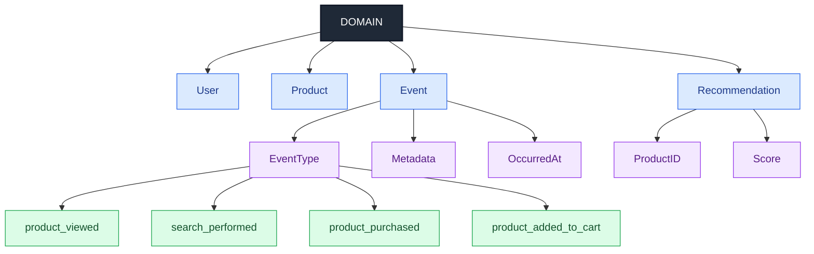

```mermaid
flowchart TD
    DOMAIN["DOMAIN"]

    DOMAIN --> USER["User"]
    DOMAIN --> PRODUCT["Product"]
    DOMAIN --> EVENT["Event"]
    DOMAIN --> RECOMMENDATION["Recommendation"]

    EVENT --> EVENT_TYPE["EventType"]
    EVENT --> METADATA["Metadata"]
    EVENT --> OCCURRED_AT["OccurredAt"]

    EVENT_TYPE --> PRODUCT_VIEWED["product_viewed"]
    EVENT_TYPE --> SEARCH_PERFORMED["search_performed"]
    EVENT_TYPE --> PRODUCT_PURCHASED["product_purchased"]
    EVENT_TYPE --> PRODUCT_ADDED_TO_CART["product_added_to_cart"]

    RECOMMENDATION --> PRODUCT_ID["ProductID"]
    RECOMMENDATION --> SCORE["Score"]

    classDef domain fill:#1f2937,stroke:#111827,color:#fff,stroke-width:2px
    classDef entity fill:#dbeafe,stroke:#2563eb,color:#1e3a8a
    classDef value fill:#f3e8ff,stroke:#9333ea,color:#581c87
    classDef eventType fill:#dcfce7,stroke:#16a34a,color:#14532d

    class DOMAIN domain
    class USER,PRODUCT,EVENT,RECOMMENDATION entity
    class EVENT_TYPE,METADATA,OCCURRED_AT,PRODUCT_ID,SCORE value
    class PRODUCT_VIEWED,SEARCH_PERFORMED,PRODUCT_PURCHASED,PRODUCT_ADDED_TO_CART eventType
```